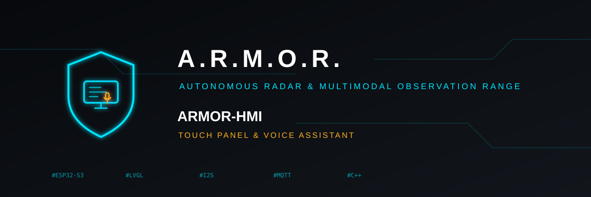

<p align="center">
  
</p>

# 🖥️ ARMOR-HMI

<p align="center">
  <a href="README.md">🇺🇸 English</a> |
  <a href="README_spa.md">🇪🇸 Español</a> |
  <a href="README_fra.md">🇫🇷 Français</a> |
  <a href="README_ita.md">🇮🇹 Italiano</a> |
  <a href="README_deu.md">🇩🇪 Deutsch</a> |
  <a href="README_zho.md">🇨🇳 简体中文</a> |
  🇯🇵 <b>日本語</b>
</p>

### 家のタッチパネル：壁に掛ける7インチ画面でシステムの状態を表示し、警戒・解除とアラームの確認ができ、将来の音声アシスタント用にマイクとスピーカーを備えています（ESP32-S3-Touch-LCD-7C-BOX 上のファミリーのノードで、設定用の専用Webページ付き）

<p align="center">
  
  
  
  
  
</p>

---

**正直さのチェック - 今日動いているもの:** **成熟度：足場段階。** ボードに依存しない部分は実物でありコンピューター上でテスト済みです（設定、パネルがサーバーについて知っていることとそれが古くなる条件、音声の会話、ボードのピン、7言語の画面テキスト：4つのテストプログラム）。Webページも実ブラウザで代替機に対して実行済みです。**ファームウェアはボード上で一度もビルド・実行されていません。** 画面、タッチ、サウンド、サーバーとの接続はこの系列のボード向けのWaveshareのサンプルから書かれており、最初のコンパイルと最初の電源投入が必要です。アシスタントが話しかける音声サービスはまだ存在せず、ウェイクワードもありません。プッシュトゥトークです。

---

## 🎯 概要

* **Android アプリと同じく ARMOR-SERVER のクライアント：** 管理者がこのパネル用に作成したユーザーでサインインし、数秒ごとに `GET /api/v1/panel/summary`（数百バイト：モード、オンラインのノード、人の対応が必要なアラーム）を取得し、人がボタンに触れて確認すると警戒・解除・確認を行います。サーバーが応答しなくなると、画面は表示が古いことを伝え、ボタンは無効になります。
* **画面（800x480、LVGL）：** 誰も見ていない最も重大なアラームの色でモードを表示し、確認の質問付きの大きな警戒/解除ボタン、オンラインのノード、アラーム（未確認を先頭に）、夜間の減光、無操作でのスリープ、新しいアラームでの音と点灯、アクセント付きの言語と、使用する文字だけのために生成したフォントで描く日本語と中国語を含む7言語に対応します。
* **他と同じノード：** ARMOR-RADAR、ARMOR-SOLAR、ARMOR-ELECTRICAL と同じ設定ストア、Wi-Fi、7言語のWebページ、スマートフォンからのBluetooth設定、ロールバック付きファームウェア更新、HTTPS を備え（`ARMOR-COMMON/firmware_base` を共有）、サーバー・画面・サウンド・音声のページが加わります。MQTT で Studio に存在を知らせ、Studio がそのページ付きで一覧表示します。
* **音声アシスタント（プッシュトゥトーク）：** タッチでマイクが開き、音声は設定したアドレスの音声サービスにのみ送られ（既定ではオフ）、返答が表示・読み上げされます。手順の順序、時間制限、タッチの動作はテスト済みのステートマシンで、パネルが自らコマンドを実行することはありません（[契約](docs/VOICE.md)）。
* **ボード：** Waveshare ESP32-S3-Touch-LCD-7C-BOX（フラッシュ32 MB、PSRAM 16 MB、GT911タッチ付き7インチRGB画面、マイク4個、スピーカー）。ピンはWaveshareのサンプル由来で、2つの機能が同じGPIOを共有しないことをテストで証明しています（[ボード](docs/HARDWARE.md)）。
* **未対応：** ファームウェアの最初のコンパイルと電源投入、ウェイクワード、Jetson 上の音声サービス、画面上のカメラ表示。

## 📂 リポジトリの構成

```text
ARMOR-HMI/
├── main/    the ESP-IDF component: app_main, display (RGB panel, GT911, LVGL), ui (the screen), audio (I2S, ES7210, ES8389), voice, server_link (HTTP to ARMOR-SERVER), board_io (I2C and the expander),
│            network, web_server, api_shared, mqtt_link, node_store, tls_cert, ble_provision (the shared node firmware), fonts/ (generated)
├── core/    hmi_config (the settings), server_view (the summary, the link, what is new), voice_session (the conversation), screen_text (seven languages), board_s3 (the pins), auth, netplan, json...
├── panel/   the web page: index.html, app.js, text.js (7 languages), style.css
├── tests/   test_config, test_view, test_voice, test_board
├── tools/   build_node.sh, make_fonts.py, pack_panel.py, panel_mock.mjs, panel_browser_test.mjs
├── docs/    DESIGN, HARDWARE, VOICE, NODE_FIRMWARE, FONTS, BLE_PROVISIONING
└── images/  brand assets
```

## 🛠️ 開発環境

```bash
cmake -S tests -B build/host && cmake --build build/host && ctest --test-dir build/host   # the settings, the server view, the voice conversation, the board's pins and the screen's words
node tools/panel_mock.mjs --user admin:adminpass123                                       # the web page without a board
node tools/panel_browser_test.mjs                                                         # the page in a real browser, every page in seven languages
tools/build_node.sh generic                                                               # the firmware image in the ESP-IDF container: dist/generic-lcd7box.bin (never built yet)
```

See the [firmware guide](docs/NODE_FIRMWARE.md) and the [Bluetooth channel](docs/BLE_PROVISIONING.md).

[設計](docs/DESIGN.md)、[ボード](docs/HARDWARE.md)、[音声アシスタント](docs/VOICE.md)、[ファームウェアガイド](docs/NODE_FIRMWARE.md)、[フォント](docs/FONTS.md)を参照してください。

## 🔗 関連プロジェクト

**A.R.M.O.R.**（Autonomous Radar & Multimodal Observation Range）は、独立したリポジトリで構成される周辺警備システムです。それぞれに独自のバージョン、テスト、README があります。ファミリーは次のとおりです：

* **[ARMOR-COMMON](https://github.com/JuanenRac/ARMOR-COMMON)** - メッセージ契約、検証器、適合性ベクトル、生成された型
* **[ARMOR-RADAR](https://github.com/JuanenRac/ARMOR-RADAR)** - ESP32-S3 用フィールドノードのファームウェア。レーダー 3 基と独自の Web パネル付き
* **[ARMOR-SOLAR](https://github.com/JuanenRac/ARMOR-SOLAR)** - 太陽光インバーターとバッテリーのプロトコル、およびゲートウェイノードのメッセージ
* **[ARMOR-ELECTRICAL](https://github.com/JuanenRac/ARMOR-ELECTRICAL)** - 電気ノード：電力量計、電力網の計測メッセージ、開閉のルール
* **ARMOR-HMI** (このリポジトリ) - タッチパネル：壁面ディスプレイでのシステム状態表示、警戒・確認操作、音声アシスタントの拠点
* **[ARMOR-NETWORK](https://github.com/JuanenRac/ARMOR-NETWORK)** - ローカルネットワーク：機器、インターネット、そして変化
* **[ARMOR-SERVER](https://github.com/JuanenRac/ARMOR-SERVER)** - 中央コーディネーター：テレメトリ、アラーム、デバイス、太陽光の測定値、カメラ
* **[ARMOR-STUDIO](https://github.com/JuanenRac/ARMOR-STUDIO)** - Web コンソール：カメラ、レーダー、アラーム、太陽光発電、2D/3D サイト設計
* **[ARMOR-ANDROID-CONTROL](https://github.com/JuanenRac/ARMOR-ANDROID-CONTROL)** - リアルタイム 2D/3D レーダー付きの Android オペレータークライアント
* **[ARMOR-SERVER-AI](https://github.com/JuanenRac/ARMOR-SERVER-AI)** - 判断を説明し、決して動作しない視覚推論ポリシー
* **[ARMOR-VOICE-AI](https://github.com/JuanenRac/ARMOR-VOICE-AI)** - 偽造できない確認を備えたオフライン音声インテント
* **[ARMOR-HARDWARE](https://github.com/JuanenRac/ARMOR-HARDWARE)** - 筐体、電子部品、ベンチ受け入れマトリクス
* **[ARMOR-DEVOPS](https://github.com/JuanenRac/ARMOR-DEVOPS)** - デプロイ、CM5 テストベンチ、バックアップ、TLS
* **[ARMOR-SIMULATOR](https://github.com/JuanenRac/ARMOR-SIMULATOR)** - 再現可能な故障を備えたオフラインのテレメトリシミュレーター
* **[ARMOR-UPDATER](https://github.com/JuanenRac/ARMOR-UPDATER)** - エコシステム自身のリポジトリを検出し、インストールし、更新する
* **[ARMOR-DOCS](https://github.com/JuanenRac/ARMOR-DOCS)** - アーキテクチャ、セキュリティ基準、機能マトリクス

## 📚 ドキュメントとコミュニティ

詳しくは：

* [機能マトリクス：実証済みのものとそうでないもの](https://github.com/JuanenRac/ARMOR-DOCS/blob/main/docs/CAPABILITY_MATRIX.md)
* [プロジェクト一覧：バージョンとリポジトリ間の依存関係](https://github.com/JuanenRac/ARMOR-DOCS/blob/main/docs/PROJECT_CATALOG.md)
* [このリポジトリの変更履歴](CHANGELOG.md)
* [ライセンス（GPL-3.0-or-later）](LICENSE)
* 質問・提案・報告：electrohobby3d@gmail.com

## 👤 作者

**JuanenRac (Electro Hobby 3D)** · electrohobby3d@gmail.com

## 📜 ライセンス

GPL-3.0-or-later - [LICENSE](LICENSE) を参照。
